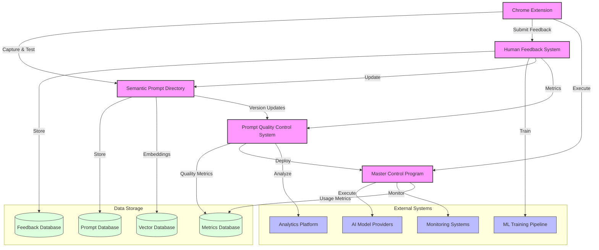

# System Architecture <!-- SPEC-001 -->

## Architecture Overview <!-- SPEC-002 -->
PromptMod is a comprehensive prompt engineering and management system consisting of several key components:
- Semantic Prompt Directory (SPD)
- Prompt Quality Control System (PQCS)
- Master Control Program (MCP)
- Chrome Extension Interface
- Human Feedback System (HFS)
- Evaluation Pipeline

## Component Diagram <!-- SPEC-003 -->

## Components <!-- SPEC-004 -->

### Semantic Prompt Directory (SPD) <!-- SPEC-005 -->
Central storage and management system for prompts with semantic understanding capabilities.

#### Responsibilities <!-- SPEC-006 -->
- Store and version control prompts
- Provide semantic search and retrieval
- Maintain prompt metadata and relationships
- Handle prompt categorization and tagging
- Support prompt templating and variables

#### Interfaces <!-- SPEC-007 -->
- REST API for CRUD operations
- GraphQL interface for complex queries
- WebSocket for real-time updates
- File system integration for bulk operations

### Prompt Quality Control System (PQCS) <!-- SPEC-008 -->
System for evaluating and maintaining prompt quality.

#### Responsibilities <!-- SPEC-009 -->
- Automated prompt testing
- Quality metrics calculation
- A/B testing framework
- Performance benchmarking
- Regression testing
- Cost analysis

#### Interfaces <!-- SPEC-010 -->
- REST API for test execution
- Webhook integration for CI/CD
- Reporting interface
- Metrics dashboard

### Master Control Program (MCP) <!-- SPEC-011 -->
Central orchestration server managing prompt deployment and execution.

#### Responsibilities <!-- SPEC-012 -->
- Prompt deployment management
- Load balancing and routing
- Rate limiting and quota management
- Model provider integration
- Authentication and authorization
- Usage tracking and billing

#### Interfaces <!-- SPEC-013 -->
- REST API for management
- gRPC for high-performance operations
- Admin dashboard
- Provider-specific adapters

### Chrome Extension <!-- SPEC-014 -->
Browser extension for prompt capture and testing.

#### Responsibilities <!-- SPEC-015 -->
- Prompt capture from web interfaces
- In-context prompt testing
- Quick access to prompt library
- Direct feedback collection
- Integration with common AI platforms

#### Interfaces <!-- SPEC-016 -->
- Chrome Extension API
- Local storage
- MCP client interface
- Context menu integration

### Human Feedback System (HFS) <!-- SPEC-017 -->
System for collecting and processing human feedback on prompt performance.

#### Responsibilities <!-- SPEC-018 -->
- Feedback collection and validation
- Quality metrics aggregation
- Pattern analysis and learning
- Improvement suggestions
- Version recommendations
- Continuous refinement

#### Interfaces <!-- SPEC-019 -->
- REST API for feedback submission
- Real-time metrics streaming
- ML pipeline integration
- Analytics dashboard

## Data Flow <!-- SPEC-020 -->
1. Prompts are created/captured via Chrome Extension or direct API
2. Stored in SPD with semantic metadata
3. Evaluated through PQCS pipeline
4. Deployed via MCP to production
5. Usage metrics and human feedback collected via HFS
6. Feedback processed and analyzed for improvements
7. Continuous improvement loop maintained

## Technology Stack <!-- SPEC-021 -->
- **Frontend**: React, TypeScript, TailwindCSS
- **Backend**: Node.js, Python (ML components)
- **Database**: PostgreSQL, Vector DB (for semantic search)
- **Infrastructure**: Docker, Kubernetes
- **ML/AI**: Sentence Transformers, LangChain
- **Monitoring**: Prometheus, Grafana

## Security Considerations <!-- SPEC-022 -->
- End-to-end encryption for sensitive prompts
- Role-based access control (RBAC)
- API key management
- Audit logging
- Data retention policies
- Model provider credential security
- PII protection
- GDPR compliance

## Scalability Approach <!-- SPEC-023 -->
- Microservices architecture
- Horizontal scaling for MCP
- Distributed prompt evaluation
- Caching layers
- Load balancing
- Database sharding
- ML pipeline scaling

## Integration Points <!-- SPEC-024 -->
- AI Model Providers (OpenAI, Anthropic, etc.)
- Version Control Systems
- CI/CD Pipelines
- Monitoring Systems
- Authentication Providers
- Analytics Platforms
- ML Training Infrastructure