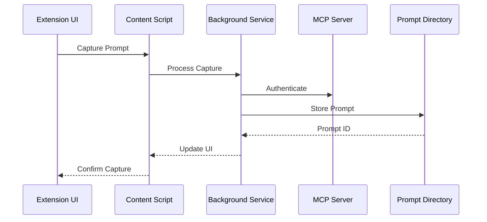

# Chrome Extension Integration <!-- SPEC-001 -->

## Overview <!-- SPEC-002 -->
The Chrome Extension integration provides a seamless interface for prompt capture, testing, and management directly from web browsers. It enables users to capture prompts from various AI platforms and integrate them into the PromptMod ecosystem.

## Integration Points <!-- SPEC-003 -->

### Content Scripts <!-- SPEC-004 -->
- Inject into supported AI platforms:
  - ChatGPT interface
  - Claude interface
  - Bard interface
  - Custom LLM interfaces
- Monitor and capture prompt interactions
- Provide inline prompt testing
- Enable direct prompt editing

### Background Service <!-- SPEC-005 -->
- Maintain connection to MCP
- Handle authentication
- Manage local cache
- Process prompt captures
- Schedule background syncs

### API Integration <!-- SPEC-006 -->
```typescript
interface ChromeExtensionAPI {
  // Prompt Management
  capturePrompt(context: CaptureContext): Promise<PromptId>;
  testPrompt(prompt: Prompt, params: TestParams): Promise<TestResult>;
  savePrompt(prompt: Prompt): Promise<void>;
  
  // Authentication
  authenticate(): Promise<AuthToken>;
  refreshToken(): Promise<AuthToken>;
  
  // Sync
  syncPrompts(): Promise<SyncResult>;
  getLocalCache(): Promise<CacheData>;
}
```

## Platform Support <!-- SPEC-007 -->

### ChatGPT Integration <!-- SPEC-008 -->
- Prompt capture from chat interface
- Context preservation
- Response tracking
- Performance metrics collection
- Direct testing integration

### Claude Integration <!-- SPEC-009 -->
- Anthropic-specific prompt formats
- Constitutional AI parameters
- System prompt handling
- Response analysis

### Custom Platform Support <!-- SPEC-010 -->
- Configurable platform detection
- Custom capture rules
- Platform-specific metadata
- Extensible integration points

## Features <!-- SPEC-011 -->

### Prompt Capture <!-- SPEC-012 -->
- One-click capture
- Context preservation
- Metadata extraction
- Variable detection
- Template generation
- Batch capture support

### Real-time Testing <!-- SPEC-013 -->
- In-context testing
- A/B comparison
- Performance metrics
- Cost estimation
- Version comparison
- Quick iterations

### Prompt Management <!-- SPEC-014 -->
- Local cache
- Offline support
- Sync management
- Version control
- Quick access
- Search functionality

## Security <!-- SPEC-015 -->
- End-to-end encryption
- Secure authentication
- API key management
- Data privacy
- Access control
- Audit logging

## Performance <!-- SPEC-016 -->
- Minimal UI latency
- Efficient background sync
- Smart caching
- Resource optimization
- Battery consideration
- Network efficiency

## Error Handling <!-- SPEC-017 -->
- Offline detection
- Sync conflicts
- API failures
- Platform changes
- Version mismatches
- Recovery procedures

## Data Flow <!-- SPEC-018 -->


## Configuration <!-- SPEC-019 -->
```typescript
interface ExtensionConfig {
  platforms: {
    [platform: string]: {
      selector: string;
      captureRules: CaptureRule[];
      metadata: MetadataExtractor;
    };
  };
  sync: {
    interval: number;
    retryStrategy: RetryConfig;
    batchSize: number;
  };
  security: {
    encryptionKey: string;
    tokenRefreshInterval: number;
  };
}
```

## Deployment <!-- SPEC-020 -->
- Chrome Web Store distribution
- Automated updates
- Version management
- Release channels
- Beta testing
- Update notifications 