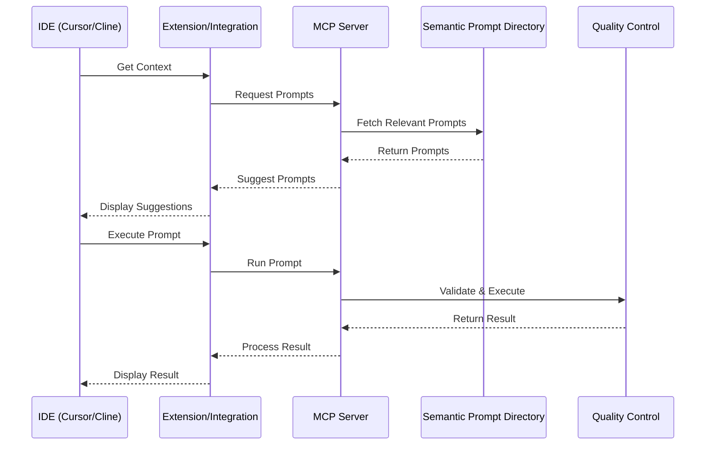

# IDE Integrations Technical Specification <!-- SPEC-001 -->

## Overview <!-- SPEC-002 -->
Integration specifications for modern AI-enhanced IDEs, focusing on Cursor and Cline. These integrations enable developers to access and manage prompts directly from their development environment, leveraging the PromptMod ecosystem for prompt versioning, testing, and deployment.

## Supported IDEs <!-- SPEC-003 -->

### Cursor Integration <!-- SPEC-004 -->
- Native extension support
- Context-aware prompt suggestions
- In-editor testing
- Version management
- Performance tracking
- Direct MCP integration

### Cline Integration <!-- SPEC-005 -->
- Terminal-based interface
- Command-line tools
- Git-like workflow
- Prompt management
- Testing capabilities
- MCP connectivity

## Common Features <!-- SPEC-006 -->

### Prompt Management <!-- SPEC-007 -->
- Browse prompt library
- Search functionality
- Version control
- Template management
- Quick access
- Favorites system

### Development Integration <!-- SPEC-008 -->
- Code context awareness
- Inline suggestions
- Documentation generation
- Code review assistance
- Refactoring support
- Testing helpers

### Version Control <!-- SPEC-009 -->
- Git-like workflow
- Branch management
- Version history
- Conflict resolution
- Merge support
- Deployment tracking

## API Interface <!-- SPEC-010 -->
```typescript
interface IDEIntegrationAPI {
  // Prompt Management
  getPrompts(context: CodeContext): Promise<Prompt[]>;
  executePrompt(id: string, context: CodeContext): Promise<ExecutionResult>;
  savePrompt(prompt: Prompt): Promise<void>;
  
  // Context Management
  getContext(): Promise<CodeContext>;
  updateContext(context: CodeContext): Promise<void>;
  
  // Version Control
  checkout(version: string): Promise<void>;
  commit(message: string): Promise<string>;
  push(): Promise<void>;
  pull(): Promise<void>;
  
  // Testing
  testPrompt(prompt: Prompt): Promise<TestResult>;
  validateContext(context: CodeContext): Promise<ValidationResult>;
}
```

## IDE-Specific Components <!-- SPEC-011 -->

### Cursor Components <!-- SPEC-012 -->
```typescript
interface CursorExtension {
  // UI Components
  sidebar: PromptExplorer;
  inlineWidget: PromptSuggestion;
  statusBar: StatusIndicator;
  
  // Features
  contextAnalyzer: ContextAnalyzer;
  suggestionEngine: SuggestionEngine;
  versionManager: VersionManager;
  
  // Integration
  mcpConnector: MCPConnection;
  promptExecutor: PromptExecutor;
  resultRenderer: ResultRenderer;
}
```

### Cline Components <!-- SPEC-013 -->
```typescript
interface ClineIntegration {
  // CLI Commands
  commands: {
    prompt: PromptCommand;
    test: TestCommand;
    version: VersionCommand;
    config: ConfigCommand;
  };
  
  // Features
  contextManager: ContextManager;
  promptRunner: PromptRunner;
  versionControl: VersionControl;
  
  // Integration
  mcpClient: MCPClient;
  resultFormatter: ResultFormatter;
  logger: Logger;
}
```

## Data Flow <!-- SPEC-014 -->


## Features <!-- SPEC-015 -->

### Context Awareness <!-- SPEC-016 -->
- Code analysis
- Language detection
- Framework recognition
- Project structure
- Dependencies
- Code patterns

### Prompt Suggestions <!-- SPEC-017 -->
- Context-based recommendations
- Historical usage
- Team favorites
- Performance metrics
- Cost optimization
- Quality scores

### Testing Integration <!-- SPEC-018 -->
- Unit test generation
- Test case management
- Coverage analysis
- Performance testing
- Regression testing
- Quality metrics

### Result Processing <!-- SPEC-019 -->
- Code formatting
- Documentation generation
- Type inference
- Error checking
- Security analysis
- Style compliance

## Security <!-- SPEC-020 -->
- Authentication
- Access control
- Data encryption
- Token management
- Audit logging
- Secure storage

## Performance <!-- SPEC-021 -->
- Response time < 50ms
- Background processing
- Caching strategy
- Resource management
- Memory optimization
- Network efficiency

## Error Handling <!-- SPEC-022 -->
- Connection issues
- Version conflicts
- Context errors
- Execution failures
- Recovery procedures
- User notifications

## Configuration <!-- SPEC-023 -->
```typescript
interface IDEConfig {
  connection: {
    mcpEndpoint: string;
    timeout: number;
    retryStrategy: RetryConfig;
  };
  features: {
    contextAwareness: boolean;
    autoSuggestions: boolean;
    inlinePreview: boolean;
  };
  security: {
    tokenStorage: TokenConfig;
    encryption: EncryptionConfig;
  };
  performance: {
    cacheSize: number;
    prefetchEnabled: boolean;
    backgroundSync: boolean;
  };
}
```

## Deployment <!-- SPEC-024 -->
- Extension marketplace
- CLI package manager
- Version updates
- Documentation
- Examples
- Support channels 