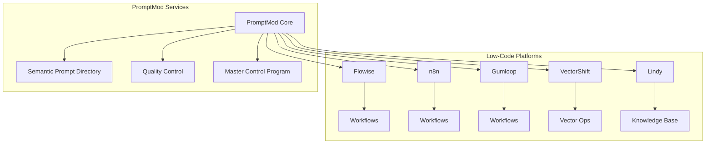

# Low-Code AI Flow Tools Integration <!-- SPEC-001 -->

## Overview <!-- SPEC-002 -->
Integration specifications for low-code AI workflow platforms, enabling PromptMod to serve as a central prompt management system for various automation and workflow tools. This integration supports prompt versioning, testing, and deployment across multiple low-code platforms.

## Supported Platforms <!-- SPEC-003 -->

### Flowise Integration <!-- SPEC-004 -->
- Custom nodes for PromptMod integration
- Prompt selection and testing
- Version management
- Real-time updates
- Performance monitoring

### n8n Integration <!-- SPEC-005 -->
- Custom nodes for prompt management
- Workflow triggers
- Prompt execution
- Results handling
- Error management

### Gumloop Integration <!-- SPEC-006 -->
- Native prompt integration
- Template management
- Version control
- Performance tracking
- Cost optimization

### VectorShift Integration <!-- SPEC-007 -->
- Vector database integration
- Semantic search capabilities
- Embedding management
- Version control
- Performance metrics

### Lindy Integration <!-- SPEC-008 -->
- Knowledge base integration
- Context management
- Version tracking
- Performance analytics
- Quality metrics

## Common API Interface <!-- SPEC-009 -->
```typescript
interface LowCodeIntegrationAPI {
  // Prompt Management
  getPrompt(id: string): Promise<Prompt>;
  listPrompts(filter: PromptFilter): Promise<Prompt[]>;
  executePrompt(id: string, params: ExecutionParams): Promise<ExecutionResult>;
  
  // Version Management
  getVersion(promptId: string, version: string): Promise<PromptVersion>;
  listVersions(promptId: string): Promise<PromptVersion[]>;
  
  // Testing & Validation
  testPrompt(prompt: Prompt, testCase: TestCase): Promise<TestResult>;
  validatePrompt(prompt: Prompt): Promise<ValidationResult>;
  
  // Analytics
  getMetrics(promptId: string): Promise<PromptMetrics>;
  trackUsage(promptId: string, usage: UsageData): Promise<void>;
}
```

## Integration Features <!-- SPEC-010 -->

### Prompt Management <!-- SPEC-011 -->
- Centralized prompt repository
- Version control
- Template management
- Variable handling
- Context preservation
- Metadata management

### Workflow Integration <!-- SPEC-012 -->
- Custom nodes/blocks
- Drag-and-drop interface
- Visual prompt selection
- Parameter configuration
- Error handling
- Results processing

### Version Control <!-- SPEC-013 -->
- Semantic versioning
- Change tracking
- Rollback support
- Branch management
- Conflict resolution
- Deployment tracking

### Analytics & Monitoring <!-- SPEC-014 -->
- Usage tracking
- Performance metrics
- Cost analysis
- Error reporting
- Quality scoring
- Optimization suggestions

## Platform-Specific Components <!-- SPEC-015 -->

### Flowise Components <!-- SPEC-016 -->
```typescript
interface FlowiseNode {
  type: 'promptmod';
  inputs: {
    prompt: PromptInput;
    parameters: ParameterInput[];
    version: VersionInput;
  };
  outputs: {
    result: ExecutionOutput;
    error: ErrorOutput;
  };
  config: FlowiseNodeConfig;
}
```

### n8n Nodes <!-- SPEC-017 -->
```typescript
interface N8nNode {
  type: 'promptmod';
  properties: {
    prompt: PromptSelector;
    version: VersionSelector;
    parameters: ParameterMapping[];
  };
  methods: {
    execute: ExecutionHandler;
    test: TestHandler;
  };
}
```

### Gumloop Integration <!-- SPEC-018 -->
```typescript
interface GumloopIntegration {
  promptSource: PromptModSource;
  versionControl: VersionController;
  executionHandler: ExecutionManager;
  analytics: AnalyticsCollector;
}
```

### VectorShift Components <!-- SPEC-019 -->
```typescript
interface VectorShiftIntegration {
  vectorStore: VectorStoreConnector;
  embeddings: EmbeddingManager;
  search: SemanticSearchHandler;
  sync: SyncManager;
}
```

### Lindy Components <!-- SPEC-020 -->
```typescript
interface LindyIntegration {
  knowledgeBase: KnowledgeBaseConnector;
  contextManager: ContextHandler;
  versionTracker: VersionManager;
  analytics: AnalyticsCollector;
}
```

## Data Flow <!-- SPEC-021 -->


## Security <!-- SPEC-022 -->
- API authentication
- Access control
- Data encryption
- Audit logging
- Rate limiting
- Error handling

## Performance Requirements <!-- SPEC-023 -->
- Response time < 100ms
- Concurrent executions
- Rate limiting
- Caching strategy
- Error recovery
- Load balancing

## Error Handling <!-- SPEC-024 -->
- Platform-specific errors
- Network issues
- Version conflicts
- Parameter validation
- Execution failures
- Recovery procedures

## Deployment <!-- SPEC-025 -->
- Platform marketplace publishing
- Version management
- Documentation
- Example workflows
- Support channels
- Update procedures 